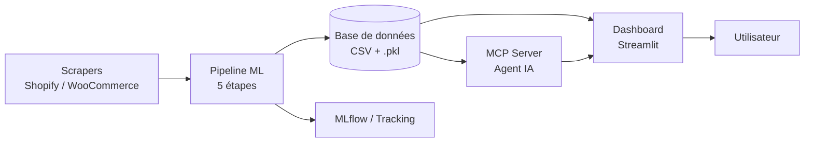

<div align="center">

# 🛒 Smart E-Commerce Intelligence

**Pipeline ML & Dashboard BI — Sélection intelligente de produits e-commerce**


📊 **Data Mining** — Cycle d'ingénieur LSI

</div>

---

## 📋 Table des matières

- [🎯 Contexte & objectif](#-contexte--objectif)
- [🏗️ Architecture](#️-architecture)
- [⚙️ Pipeline Data Mining](#️-pipeline-data-mining)
- [✨ Fonctionnalités](#-fonctionnalités)
- [📦 Prérequis](#-prérequis)
- [🚀 Installation](#-installation)
- [💻 Utilisation](#-utilisation)
- [📁 Structure du projet](#-structure-du-projet)
- [🛠️ Technologies](#️-technologies)
- [👤 Auteur](#-auteur)

---

## 🎯 Contexte & objectif

Ce projet applique les techniques de **Data Mining** à la sélection de produits e-commerce. L'objectif est de construire un pipeline automatisé de **A à Z** :

<p align="center">
<strong>🔄 Collecte → Nettoyage → Analyse → Scoring → Prédiction → Visualisation</strong>
</p>

| Étape | Action |
|:---|---:|
| **1** | Collecter des données produits (Shopify, WooCommerce) |
| **2** | Nettoyer, normaliser et enrichir les données |
| **3** | Calculer un **score composite** pour classer les produits |
| **4** | Segmenter le catalogue par **clustering** |
| **5** | Prédire les produits à fort potentiel (modèles supervisés) |
| **6** | Générer des **règles d'association** pour le cross-selling |
| **7** | Visualiser le tout via un **dashboard interactif** |

---

## 🏗️ Architecture



<details>
<summary>📐 Vue textuelle détaillée</summary>

```
┌──────────────┐     ┌──────────────┐     ┌──────────────┐     ┌──────────────┐
│  Scrapers    │────>│  Pipeline ML │────>│  Modèles     │────>│  Dashboard   │
│  (collecte)  │     │  (5 étapes)  │     │  .pkl + CSV  │     │  Streamlit   │
└──────────────┘     └──────────────┘     └──────────────┘     └──────────────┘
                            │
                            v
                    ┌──────────────┐
                    │  MCP Server  │
                    │  (Agent IA)  │
                    └──────────────┘
```
</details>

> Le projet suit une architecture **modulaire** : chaque étape est indépendante et exécutable séparément, localement ou en environnement conteneurisé (Docker, Kubeflow).

---

## ⚙️ Pipeline Data Mining

Le pipeline ML se décompose en **5 étapes** suivant la méthodologie **CRISP-DM** :

<table>
<tr>
<th>#</th>
<th>Étape</th>
<th>Fichier</th>
<th>Actions</th>
</tr>
<tr>
<td align="center">1</td>
<td><strong>🧹 Prétraitement</strong></td>
<td><code>preprocessing.py</code></td>
<td>Chargement, déduplication, imputation, filtrage, normalisation MinMax,<br/>feature engineering (prix_par_rating, engagement, log_reviews)</td>
</tr>
<tr>
<td align="center">2</td>
<td><strong>📊 Scoring</strong></td>
<td><code>scoring.py</code></td>
<td>Score composite pondéré (prix −0.2, rating 0.4, reviews 0.3, stock 0.1)<br/>→ sélection automatique du <strong>Top-K</strong></td>
</tr>
<tr>
<td align="center">3</td>
<td><strong>🤖 Supervisé</strong></td>
<td><code>supervised.py</code></td>
<td><strong>Random Forest</strong> (100 arbres) + <strong>XGBoost</strong><br/>Target : top 20% · Éval : F1, Accuracy, Precision, Recall, Confusion Matrix</td>
</tr>
<tr>
<td align="center">4</td>
<td><strong>📈 Clustering</strong></td>
<td><code>clustering.py</code></td>
<td><strong>KMeans</strong> (silhouette optimale) · <strong>DBSCAN</strong> · <strong>Hiérarchique</strong><br/>PCA 2D · Interprétation automatique (premium, discount, top-rated…)</td>
</tr>
<tr>
<td align="center">5</td>
<td><strong>🔗 Association</strong></td>
<td><code>association_rules.py</code></td>
<td>Algorithme <strong>Apriori</strong> (support≥0.01, confiance≥0.5, lift≥1.0)<br/>Analyse cross-canal catégorie × marque × cluster</td>
</tr>
</table>

---

## ✨ Fonctionnalités

<div align="center">

### 📊 Dashboard BI (Streamlit)

</div>

| Fonctionnalité | Description |
|:---|---|
| **🏆 Top-K Produits** | Tableau interactif des 100 meilleurs produits, export CSV |
| **📈 Visualisations** | Scatter, box plot, bar chart, pie chart, carte choroplèthe (Plotly) |
| **🧠 Analyse LLM** | Résumés, tendances, stratégies marketing & analyse concurrentielle via **Groq API (Llama 3.3 70B)** |
| **💬 Chatbot** | Question-réponse sur les données e-commerce |
| **🎛️ Filtres** | Catégorie, cluster, plateforme, prix, score — tout est interactif |

<div align="center">

### 🤖 Agent MCP (Model Context Protocol)

</div>

| Composant | Détail |
|:---|---|
| **🔐 3 rôles** | `viewer` (lecture), `analyst` (+ export), `admin` (+ pipeline, permissions) |
| **🛠️ 8 outils** | Recherche produits, top-k, clusters, stats, export, pipeline, permissions |
| **📝 Journalisation** | Chaque appel est loggé avec timestamp, utilisateur, params, statut |
| **🛡️ Isolation** | Un viewer ne voit que 4 outils — un admin voit tout |

<div align="center">

### ⚡ MLOps

</div>

- **🐳 Docker Compose** — orchestration locale des 6 services
- **☸️ Kubeflow Pipelines** — définition KFP v2 pour déploiement Kubernetes
- **🤖 GitHub Actions** — CI : build Docker + compilation KFP automatisés

---

## 📦 Prérequis

- Python **3.10+**
- `virtualenv` (recommandé)
- Docker (optionnel, pour l'orchestration conteneurisée)

---

## 🚀 Installation

### 1. Cloner le projet

```powershell
git clone https://github.com/Marouanof/smart-ecommerce-intelligence.git
cd smart-ecommerce-intelligence
```

### 2. Environnement virtuel

```powershell
python -m venv venv
.\venv\Scripts\Activate.ps1
```

### 3. Dépendances

```powershell
pip install pandas numpy scikit-learn xgboost joblib mlxtend
pip install streamlit plotly matplotlib seaborn httpx python-dotenv
pip install requests beautifulsoup4 playwright kfp
```

### 4. Variables d'environnement

Créer un fichier `.env` à la racine :

```ini
GROQ_API_KEY=gsk_votre_cle_groq
HUGGINGFACE_TOKEN=hf_votre_token
```

> 💡 **Astuce** : Sans `GROQ_API_KEY`, la dashboard fonctionne mais les fonctionnalités LLM (analyse concurrentielle, stratégies marketing, chatbot) sont désactivées.

---

## 💻 Utilisation

### 🧪 Scraper les données brutes (optionnel)

Des données sont déjà fournies dans `data/raw/`. Pour rescraper :

```powershell
python -m scrapers.run_shopify            # Scraper réel Shopify
python -m scrapers.scrape_woocommerce_demo # Données WooCommerce de démo
```

### ▶️ Exécuter le pipeline ML complet

```powershell
python -m TopKselection.pipeline
```

**Sorties produites :**

| Étape | Fichier de sortie |
|:---|---|
| 1. Preprocessing | `data/processed/cleaned_products.csv` |
| 2. Scoring | `data/processed/products_with_score.csv` + `TopKselection/output/top_k_products.csv` |
| 3. Supervised | `TopKselection/models/random_forest.pkl` + `xgboost.pkl` |
| 4. Clustering | `data/processed/products_with_clusters.csv` |
| 5. Association | `TopKselection/output/association_rules.csv` |
| 📋 Rapport | `TopKselection/output/pipeline_report.txt` |

### 🖥️ Lancer la dashboard

```powershell
streamlit run dashboard/app.py
```

> Accès : [http://localhost:8501](http://localhost:8501) 🎉

### 🐳 Orchestration Docker

```powershell
docker-compose -f docker/docker-compose.yml up --build
```

### ☸️ Orchestration Kubeflow

```powershell
pip install kfp
python kfp_pipeline.py     # Génère kfp_pipeline.yaml
```

> Le fichier `kfp_pipeline.yaml` peut être uploadé sur un cluster Kubeflow.

---

## 📁 Structure du projet

```
📦 smart-ecommerce-intelligence
│
├── 📂 TopKselection/               ← Pipeline ML (5 étapes)
│   ├── 📄 preprocessing.py         → Étape 1 : Prétraitement
│   ├── 📄 scoring.py               → Étape 2 : Scoring + Top-K
│   ├── 📄 supervised.py            → Étape 3 : Random Forest + XGBoost
│   ├── 📄 clustering.py            → Étape 4 : KMeans, DBSCAN, Hiérarchique
│   ├── 📄 association_rules.py     → Étape 5 : Apriori
│   ├── 📄 pipeline.py              → Orchestrateur local
│   ├── 📂 models/                  → Modèles entraînés (.pkl)
│   └── 📂 output/                  → Rapports et exports CSV
│
├── 📂 scrapers/                    ← Collecte de données
│   ├── 📄 base.py                  → Classe Product, BaseScraper
│   ├── 📄 shopify.py               → Scraper Shopify
│   ├── 📄 woocommerce.py           → Scraper WooCommerce
│   ├── 📄 orchestrator.py          → Détection plateforme + orchestration
│   ├── 📄 run_shopify.py           → Lanceur scraping en masse
│   └── 📄 scrape_woocommerce_demo.py → Scraper WooCommerce de démonstration
│
├── 📂 dashboard/                   ← Interface utilisateur
│   └── 📄 app.py                   → Dashboard Streamlit (BI + LLM + MCP)
│
├── 📂 agents/                      ← Agent IA (MCP)
│   ├── 📄 mcp_server.py            → Serveur d'outils
│   ├── 📄 mcp_client.py            → Client MCP
│   └── 📄 permissions.json         → Règles d'accès par rôle
│
├── 📂 llm/                         ← Intelligence artificielle
│   └── 📄 enrichment.py            → Enrichissement LLM (Hugging Face)
│
├── 📂 data/
│   ├── 📂 raw/                     → Données brutes (CSV)
│   └── 📂 processed/               → Données transformées (CSV)
│
├── 📂 docker/                      ← Conteneurisation
│   ├── 📄 docker-compose.yml       → 6 services orchestrés
│   ├── 📂 preprocessing/Dockerfile
│   ├── 📂 scoring/Dockerfile
│   ├── 📂 supervised/Dockerfile
│   ├── 📂 clustering/Dockerfile
│   ├── 📂 association/Dockerfile
│   └── 📂 dashboard/Dockerfile
│
├── 📂 .github/workflows/           ← CI/CD
│   ├── 📄 docker-build.yml         → Build et test des images Docker
│   └── 📄 kubeflow-pipeline.yml    → Compilation et validation KFP
│
├── 📄 kfp_pipeline.py              → Définition Kubeflow Pipeline
├── 📄 kfp_pipeline.yaml            → Pipeline compilé (prêt à déployer)
├── 📄 requirements.txt             → Dépendances scraping
├── 📄 .gitignore
└── 📄 README.md
```

---

## 🛠️ Technologies

<div align="center">

| Domaine | Technologies |
|:---|---:|
| **🧠 Data Mining** | `scikit-learn` · `XGBoost` · `mlxtend` (Apriori) |
| **📊 Visualisation** | `Streamlit` · `Plotly` · `Matplotlib` · `Seaborn` |
| **🤖 LLM** | `Groq API` (Llama 3.3 70B) · `Hugging Face Inference API` |
| **🐳 Conteneurisation** | `Docker` · `Docker Compose` |
| **☸️ Orchestration ML** | `Kubeflow Pipelines` (KFP v2) |
| **🔄 CI/CD** | `GitHub Actions` |
| **🔌 MCP** | Architecture serveur/client avec contrôle d'accès par rôles |
| **🕷️ Scraping** | `BeautifulSoup` · `Playwright` · `httpx` |

</div>

---

## 👤 Auteur

Projet réalisé dans le cadre du module **📊 Data Mining** — Cycle d'ingénieur LSI.

---

<div align="center">

⭐ **Merci pour votre intérêt !** ⭐

*Dernière mise à jour : Mai 2026*

</div>
